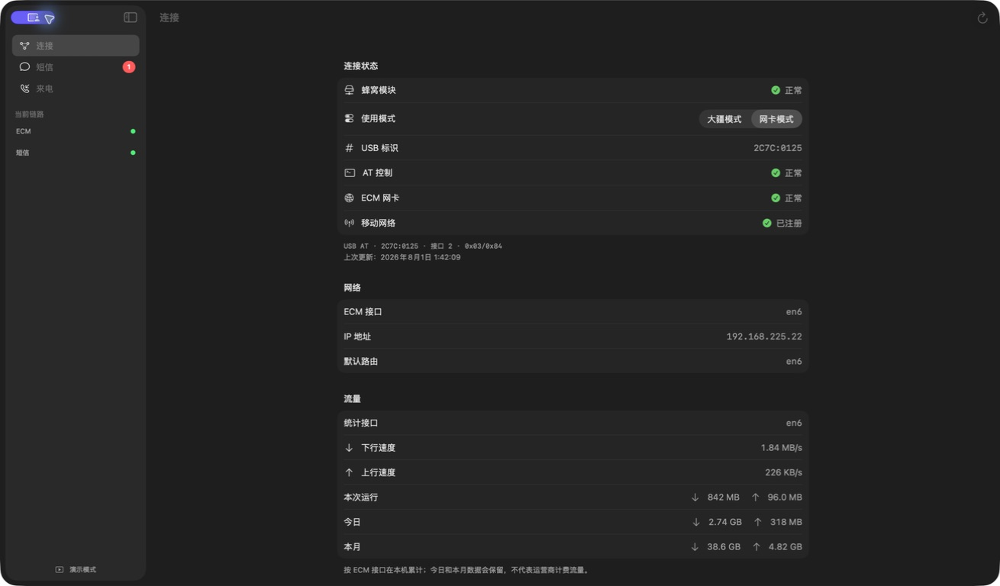
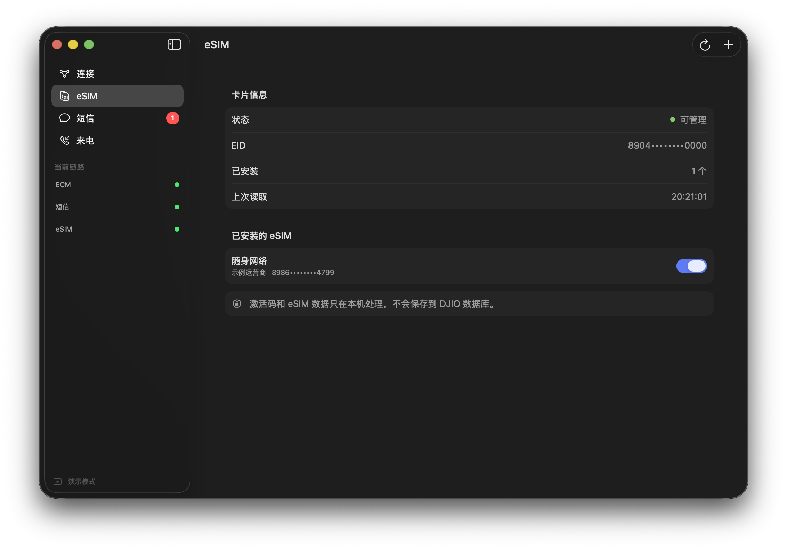
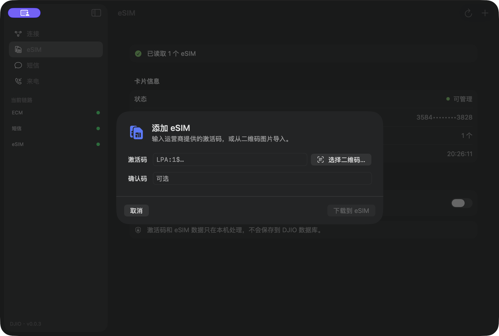
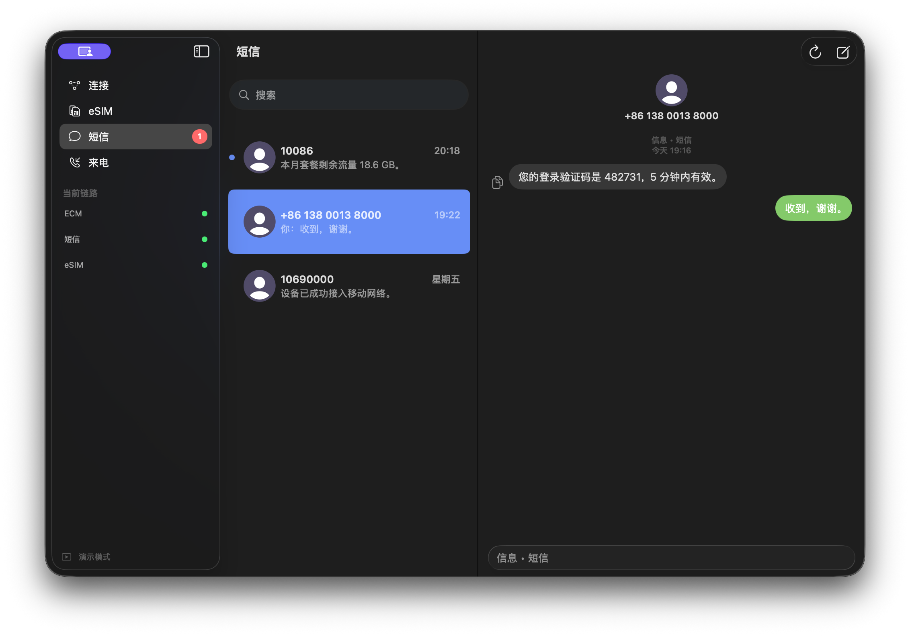
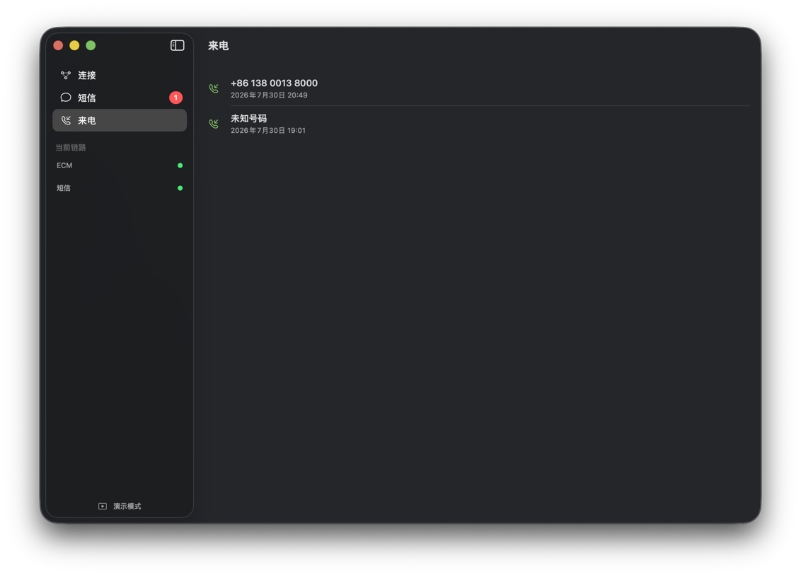
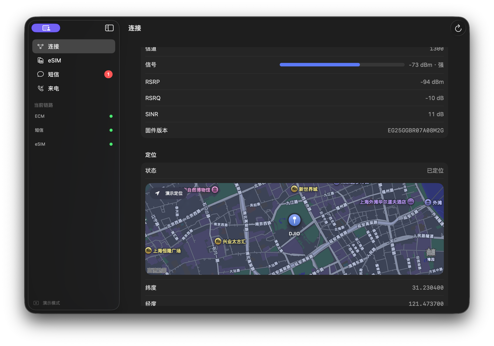
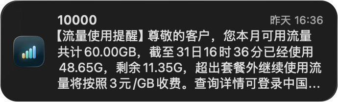

# DJIO

<p align="center">
  
</p>

DJIO 是一款原生 macOS 工具，可将受支持的蜂窝 USB 模块用作 Mac 的便携式
4G 网卡，并提供 eSIM 管理、短信、接码和来电号码记录功能。它可以配置 ECM
网络、管理兼容 eSIM 卡、收发短信、接收验证码，以及记录来电号码和时间。

当前版本：`0.0.4`（构建版本 `3`）

DJIO 只记录来电号码，不能接听电话、传输通话音频、提供语音信箱，也不实现
VoWiFi/IMS 通话。

## 功能

- 将兼容模块配置为 ECM 网卡，并可完整恢复第一代大疆 4G 模块的原始 USB 状态
- 显示连接、SIM 卡、运营商、无线制式、信号和本机流量信息
- 通过大疆 4G 模块管理兼容的 eSIM 卡：读取 EID、导入运营商二维码或 LPA 激活码、启用或停用 eSIM，以及设置昵称
- 按需启用模块 GNSS，显示经纬度、海拔、定位精度和卫星数量，并在原生地图上标记当前位置
- 收发短信，支持长短信、GSM 7-bit 和 Unicode
- 将验证码作为普通短信接收
- 为新短信和来电显示 macOS 通知
- 在本机保存短信、发件记录、来电记录和流量统计
- 支持菜单栏运行和登录时自动启动

## 界面预览

> 以下截图均使用内置演示数据，不包含真实短信、电话号码或网络信息。

<div align="center">
<table>
  <tr>
    <td width="50%"></td>
    <td width="50%"></td>
  </tr>
  <tr>
    <td width="50%"></td>
    <td width="50%"></td>
  </tr>
  <tr>
    <td width="50%"></td>
    <td width="50%"></td>
  </tr>
</table>
</div>

### 通知

<div align="center">
<table>
  <tr>
    <td width="50%"></td>
    <td width="50%"></td>
  </tr>
</table>
</div>

来电浮窗中的绿色按钮用于打开 DJIO 的来电页面，不表示接听电话。DJIO 不传输
通话音频，也不提供接听功能。

## Mac、iPad 与其他 USB 主机

DJIO 本身运行于 macOS。模块配置为 ECM 模式后，会向 USB 主机提供一个标准的
USB 虚拟以太网接口。理论上，支持 USB Host、CDC-ECM 驱动并能为模块供电、配置
网络的设备都可以使用这条数据连接，例如 macOS、Linux、部分 Windows 设备、
USB-C iPad、Android 设备或支持 USB 网卡的路由器。

这并不代表所有设备都能直接使用：实际兼容性还取决于主机的 ECM 驱动、USB
接口和供电、模块固件暴露的 USB 配置、DHCP/APN 设置以及设备自身的网络策略。
Windows 主机尤其可能需要额外的 CDC-ECM 驱动。

DJIO 不包含 iPadOS、Windows 或 Android 应用。其他主机可以使用 ECM 网络连接，
但短信管理、eSIM 管理和来电提醒仍需要将模块连接到正在运行 DJIO 的 Mac。

## 硬件支持

| USB 标识 | 支持情况 |
| --- | --- |
| `2CA3:4006` | 第一代大疆 4G 模块的原厂 USB 身份；DJIO 可将其转换为下方兼容身份以启用 ECM，也可完整恢复原始状态 |
| `2C7C:0125` | Quectel EC25 兼容身份；已实机验证 ECM、短信和来电记录；仅确认由第一代大疆模块转换而来时才可恢复 |

DJIO 的短信与状态查询也可以回退到兼容的 `/dev/cu.*` AT 串口，以 115200
波特率工作。USB 身份转换和完整恢复必须使用受支持的 USB AT 通道。

eSIM 管理要求卡片实现 GSMA eUICC 本地管理接口，并允许通过模块的 `AT+CSIM`
通道访问。DJIO 内置独立的 `lpac` 辅助进程，用于下载、启用、停用和设置 eSIM
昵称；激活码与确认码通过标准输入传递，不会出现在进程命令行中。不同空白 eSIM
卡、运营商和模块固件的兼容性可能不同。

检测到原厂 `2CA3:4006` 时，经用户确认后，DJIO 会先使用
`AT+QCFG="usbcfg",0x2C7C,0x0125,1,1,1,1,1,0,0` 将模块持久转换为
`2C7C:0125`，再通过
`AT+QCFG="usbnet",1` 配置 ECM；如果模块没有立即重新枚举，再以
`AT+CFUN=1,1` 软重启。USB 身份转换只修改模块内部配置，不会刷写或替换
模块固件。设置断电后仍会保留。转换和重新枚举验证期间，请只连接一只受支持
的 4G 模块。

对于确认由第一代大疆模块转换而来的 `2C7C:0125` 设备，DJIO 也可以通过一次
“恢复大疆原始 USB 状态”操作，完整恢复无人机使用所需的原始 USB 状态：

1. 读取模块 IMEI，用于确保两次重新枚举前后操作的是同一只设备；
2. 使用 `AT+QCFG="usbcfg",0x2CA3,0x4006,1,1,1,1,1,0,0` 持久恢复
   原厂 USB 配置，查询确认后软重启；
3. 在至少约 30 秒的多轮检查中等待模块以 `2CA3:4006` 重连，再将 `usbnet`
   持久恢复为 `0`（大疆私有模式）；
4. `usbnet` 修改会自行触发第二次重新枚举；DJIO 会记录枚举前后的 USB
   bus/address 作为辅助信息，并以模块身份一致、USB 标识为 `2CA3:4006`、
   模式为 `usbnet=0` 作为最终恢复结果。macOS 即使复用原来的 bus/address，
   也不会影响恢复流程继续执行。

两个阶段由 DJIO 自动连续执行。即使第一次重新枚举超过当前等待时间，模块稍后
重新出现时也会从检查点自动继续恢复 `usbnet=0`，不需要再次点击恢复按钮。

这会撤销 DJIO 为 Mac 网卡用途修改的 USB 标识和 ECM 模式，但不是刷写固件或
清除模块全部 NV 配置。`2C7C:0125` 也可能是真正的 Quectel 设备；无法确认
来源时请勿执行恢复。转换和恢复期间请只连接一只受支持的 4G 模块。恢复流程基于
[QDC507 usbnet 实机调查](https://github.com/KirisameLonnet/qdc507-macos-serial-driver/blob/1db7cbc42d7893db71e4b0b000e8488f8731ad59/notes/2026-07-12-usbnet-mode-survey.md)
和
[原始 USB 配置恢复记录](https://github.com/AcaciusShun/acacius-site/blob/06860f12d852ce30d7535b900ad1f5345bbd1c9e/src/content/blog/dji-4g-module-vohive-deployment-and-recovery.md)，
`usbnet=0` 的大疆私有模式也可参见
[dji-cellular-as-modem](https://github.com/CdricZhang/dji-cellular-as-modem/blob/c055efe0f1b4cfc6dbc27e6a2ce775ba80a6acf8/README.md)。
恢复状态机和故障分支已通过模拟传输测试；当前仓库不包含会对真实模块写入持久配置
的自动化测试。

控制通道尽量使用标准 AT 指令，同时包含少量 Quectel 专用行为，因此支持 AT
指令的模块不一定能直接使用 DJIO。来电记录还依赖模块和运营商提供 `RING`、
`+CLIP` 或 `AT+CLCC` 信息。隐藏或无法获取的来电号码会记录为未知号码。

DJIO 不会分离 ECM 内核驱动、切换主机侧 USB configuration 或抢占 ECM 接口。
仅在用户明确确认后，应用会修改模块内部的 USB 身份和网络模式并执行软重启；
macOS 仍负责管理 ECM 网络接口。

## 构建

环境要求：

- 运行 macOS 26 的 Apple 芯片 Mac
- Xcode 26.6 或更高版本
- Homebrew `libusb` 和 `pkgconf`

```bash
brew install libusb pkgconf
swift test
./scripts/build-app.sh
open -n ../outputs/DJIO.app --args --demo
```

构建脚本会生成 `../outputs/DJIO.app`，嵌入 Homebrew 提供的 `libusb` 动态库，
内置并校验固定版本的 `lpac` 辅助工具，重写动态库加载路径，并为应用添加本地临时
签名。

文档截图可使用脱敏演示数据重新生成：

```bash
open -n ../outputs/DJIO.app --args --demo --preview-connection
open -n ../outputs/DJIO.app --args --demo --preview-esim
open -n ../outputs/DJIO.app --args --demo --preview-messages
open -n ../outputs/DJIO.app --args --demo --preview-calls
open -n ../outputs/DJIO.app --args --demo --preview-incoming-call
```

## 本地数据与隐私

DJIO 不使用账号、分析统计、云同步或外部应用服务器。短信、发件状态、来电记录和
流量统计均保存在 `~/Library/Application Support/CellularBridge/`。这里有意
保留了旧版内部目录名，确保升级为 DJIO 后仍可继续使用已有数据。

eSIM 激活码和确认码只在导入期间使用，不会写入 DJIO 数据库。eSIM 的 EID、
ICCID、运营商名称和昵称来自卡片，界面默认对 EID 与 ICCID 进行遮罩显示。

你发送的短信和网络流量仍会经过移动运营商。通知内容是否在锁定屏幕上显示由
macOS 通知设置决定。流量统计来自 macOS 网络接口计数器，并非运营商账单数据。

## 限制

- DJIO 只记录来电号码和时间
- 不能接听电话或传输通话音频
- 来电挂断依赖模块支持相关 AT 指令
- 不提供通话音频、语音信箱、VoWiFi 或 IMS 通话
- 不保证支持列表之外的硬件
- eSIM 管理兼容性取决于 eSIM 卡、模块固件、运营商服务器和 `AT+CSIM` 支持情况
- 来电号码能否获取取决于模块、SIM 卡、运营商和网络
- GNSS 定位需要模块固件支持、有效的 GNSS 天线和适合接收卫星信号的环境

## 分发说明

当前嵌入的 Homebrew `libusb` 仅支持 arm64，并且以 macOS 26 为最低目标，适合
在当前配置上本地构建，但不适合作为通用二进制版本发布。正式分发时应嵌入面向预期
系统版本构建的通用 `libusb`，并使用 Developer ID 完成签名和公证。

## 独立声明

DJIO 是独立、非官方项目，与大疆、Quectel 或任何移动运营商均无关联。
